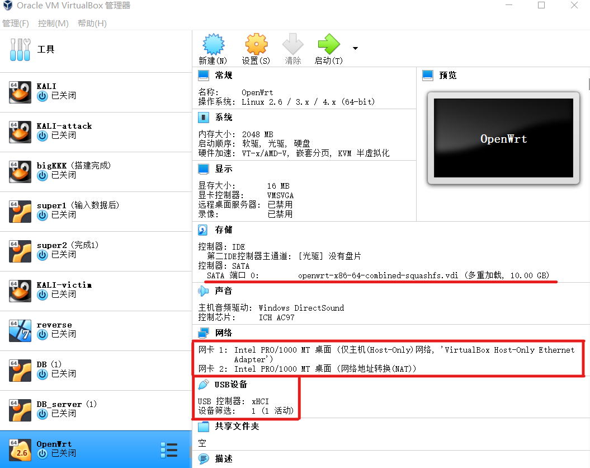
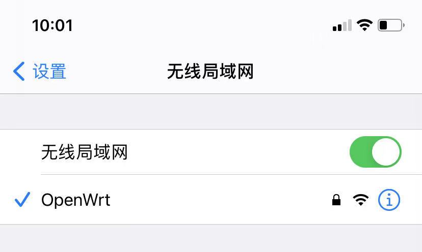

# 移动互联网安全第一章实验报告  
## OpenWrt on VirtualBox  
### 实验目的  
* 熟悉基于 OpenWrt 的无线接入点（AP）配置  
* 为第二章、第三章和第四章实验准备好「无线软 AP」环境  
### 实验环境  
* Virtualbox  
* 可以开启监听模式、AP 模式和数据帧注入功能的 USB 无线网卡  
### 实验要求  
 - [x] 对照第一章实验`无线路由器/无线接入点（AP）配置`列的功能清单，找到在`OpenWrt`中的配置界面并截图证明  
 - [x] 记录环境搭建步骤  
 - [x] 如果 USB 无线网卡能在`OpenWrt`中正常工作，则截图证明  
 - [x] 如果 USB 无线网卡不能在`OpenWrt`中正常工作，截图并分析可能的故障原因并给出可能的解决方法  

### 实验过程  
#### 复习VirtualBox的配置与使用  
1. 虚拟机镜像列表  
  
2. 设置虚拟机和宿主机的文件共享，实现宿主机和虚拟机的双向文件共享  
  
3. 虚拟机镜像备份和还原的方法  
  
4. 熟悉虚拟机基本网络配置，了解不同联网模式的典型应用场景  
  
[VirtualBox虚拟机几种网络连接方式介绍](https://blog.csdn.net/bifengmiaozhuan/article/details/79887692)  

#### OpenWrt on VirtualBox  
由于系统为Windows，按照bash脚本手动配置如下：  
1. 下载[openwrt-19.07.5-x86-64-combined-squashfs.img.gz](https://downloads.openwrt.org/releases/19.07.5/targets/x86/64/openwrt-19.07.5-x86-64-combined-squashfs.img.gz)  
2. `gunzip openwrt-19.07.5-x86-64-combined-squashfs.img.gz`解压缩  
  
3. `VBoxManage convertfromraw --format VDI openwrt-19.07.5-x86-64-combined-squashfs.img openwrt-x86-64-combined-squashfs.vdi`转换格式  
    * 转换格式过程中`VBoxManage`报错  
      
    按照bash中[提示信息](https://openwrt.org/docs/guide-user/virtualization/virtualbox-vm#convert_openwrtimg_to_vbox_drive)执行`dd`命令  
    `dd if=openwrt-19.07.5-x86-64-combined-squashfs.img of=openwrt-19.07.5-x86-64-combined-squashfs-padded.img bs=128000 conv=sync`  
    
    格式转换成功：
     
   tip:别忘记把VirtualBox的路径加入到环境变量，来回找路径real麻烦！！！  
4. 创建`OpenWrt`虚拟机  
  
  
tips:镜像类型改为多重加载/虚拟磁盘扩容/网卡按照要求进行配置/启用USB 3.0接口  
网卡配置情况：  
    * 第一块网卡设置为：Intel PRO/1000 MT 桌面（仅主机(Host-Only)网络）  
    * 第二块网卡设置为：Intel PRO/1000 MT 桌面（网络地址转换(NAT)）  
5. 启动`OpenWrt`虚拟机  
  
6. 修改`/etc/config/network`  
  
`ifdown eth0 && ifup eth0`重启网卡使得修改生效  
  
7. 访问IP地址登录管理界面  
  

#### 开启 AP 功能  
当前待接入 USB 无线网卡的芯片信息可以通过在 Kali 虚拟机中使用`lsusb`的方式查看，但默认情况下 OpenWrt 并没有安装对应的软件包，需要通过如下`opkg`命令完成软件安装  
`opkg update && opkg install usbutils`安装usbutils  
安装好`usbutils`之后，通过以下 2 个步骤可以确定该无线网卡的驱动是否已经安装好  
```
# 查看 USB 外设的标识信息
lsusb
# 查看 USB 外设的驱动加载情况
lsusb -t
```  
  
```
#快速查找可能包含指定芯片名称的驱动程序包
opkg find kmod-* | grep 9271
#a安装驱动
opkg install kmod-ath9k-htc
```  
  
默认情况下，OpenWrt 只支持`WEP`系列过时的无线安全机制，为了让 OpenWrt 支持`WPA`系列更安全的无线安全机制，还需要额外安装 2 个软件包：`wpa-supplicant`和` hostapd`，其中`wpa-supplicant`提供 WPA 客户端认证，`hostapd`提供 AP 或 ad-hoc 模式的 WPA 认证  
`opkg install hostapd wpa-supplicant`安装hostapd wpa-supplicant  

配置成功，重启后生效  
  
无线网络配置尝试  
  
手机尝试连接  
  

#### 无线路由器/无线接入点（AP）配置清单检查  
以下实验，默认配置的是AP，除非特别说明时会强调该实验内容需要无线路由器支持  
* 重置和恢复AP到出厂默认设置状态  
  
* 设置AP的管理员用户名和密码  
  
* 设置SSID广播和非广播模式  
  
* 配置不同的加密方式  
  
* 设置AP管理密码  
  
* 配置无线路由器使用自定义的DNS解析服务器  
  
* 配置DHCP和禁用DHCP  
  
* 开启路由器/AP的日志记录功能（对指定事件记录）  
  
* 配置AP隔离(WLAN划分)功能  
  
* 设置MAC地址过滤规则（ACL地址过滤器）  
  
* 查看WPS功能的支持情况  
  
* 查看AP/无线路由器支持哪些工作模式  
  

#### 使用手机连接不同配置状态下的AP对比实验  
将加密类型进行改变，尝试不同加密类型  
  
更改后手机连接不再提示风险WiFi  
  

#### 使用路由器/AP的配置导出备份功能，尝试解码导出的配置文件  
  

#### 实验问题与解决  
1. Windows环境下在进行vdi格式转换时报错  
  
错误原因：Windows官网下载的`dd`似乎有点小问题  
解决方案：Kali中使用`dd`/Git Bash使用`dd`  
2. vdi已扩容情况下OpenWrt下载过程中磁盘空间不足报错  
  
错误原因：扩容时机有误，应在没启动系统前扩容，启动系统后扩容无效  
解决方案：重来一遍:joy:其实在第一次OpenWrt启动设置过程中隐隐有种不对的预感，结果到要开启AP功能时才发现错误，**要注意顺序**，手动重装OpenWrt666  
  
3. 安装 hostapd wpa-supplicant 过程中报错  
  
错误原因：某些程序无法opkg正常安装，后面加强制执行参数  
解决方案：`opkg install hostapd wpa-supplicant --force-depends`  

##### 参考资料  
[移动互联网安全第一章实验](https://c4pr1c3.github.io/cuc-mis/chap0x01/exp.html)  
[OpenWrt on VirtualBox HowTo](https://openwrt.org/docs/guide-user/virtualization/virtualbox-vm)  
[Cannot satisfy the following dependencies](https://blog.csdn.net/qiaoshuo/article/details/89443704)  
[opkg update失败问题解决](https://blog.csdn.net/qq_27508477/article/details/88370834?utm_medium=distribute.pc_relevant.none-task-blog-2%7Edefault%7EBlogCommendFromMachineLearnPai2%7Edefault-2.control&dist_request_id=1328741.14709.16168461453577307&depth_1-utm_source=distribute.pc_relevant.none-task-blog-2%7Edefault%7EBlogCommendFromMachineLearnPai2%7Edefault-2.control)  
