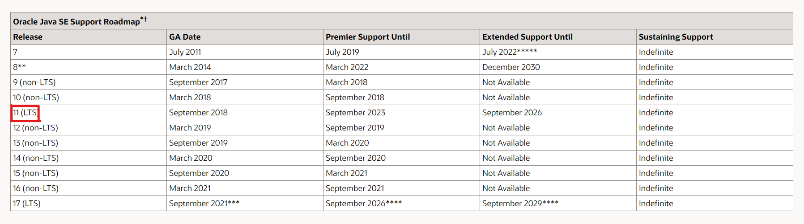
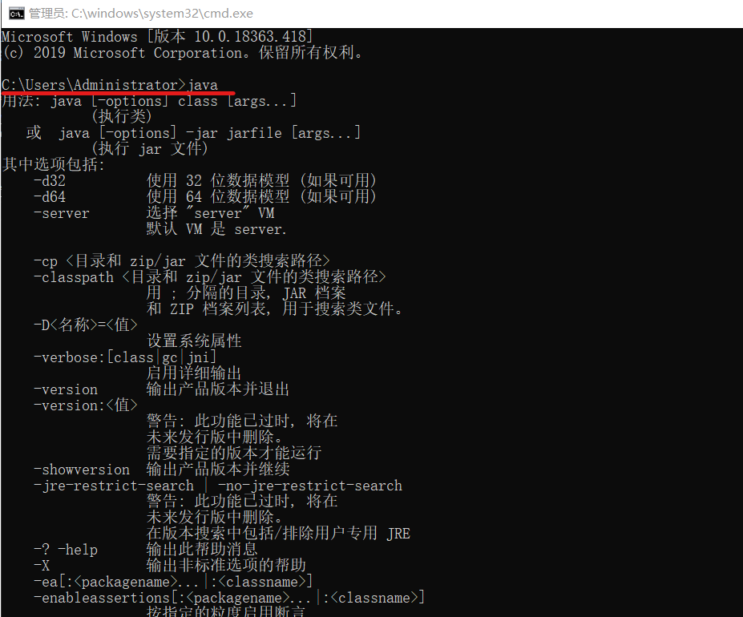
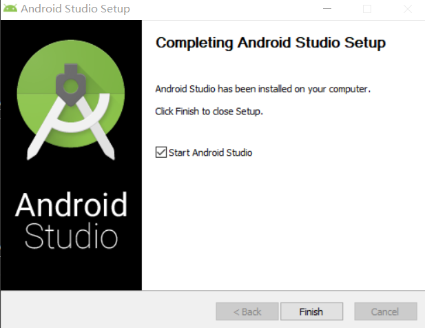
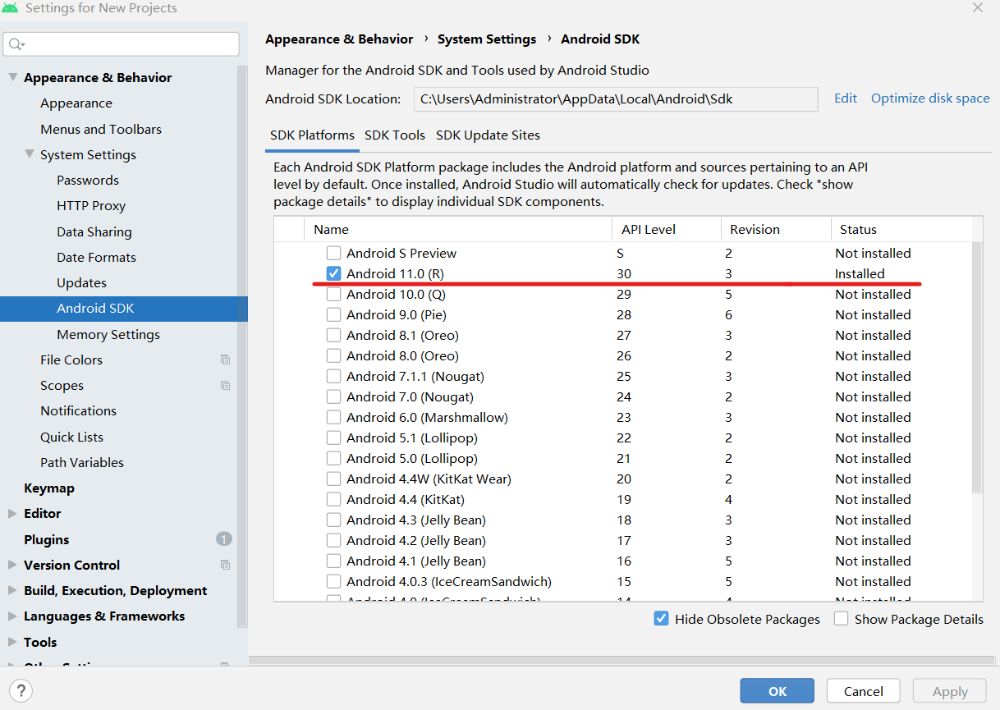
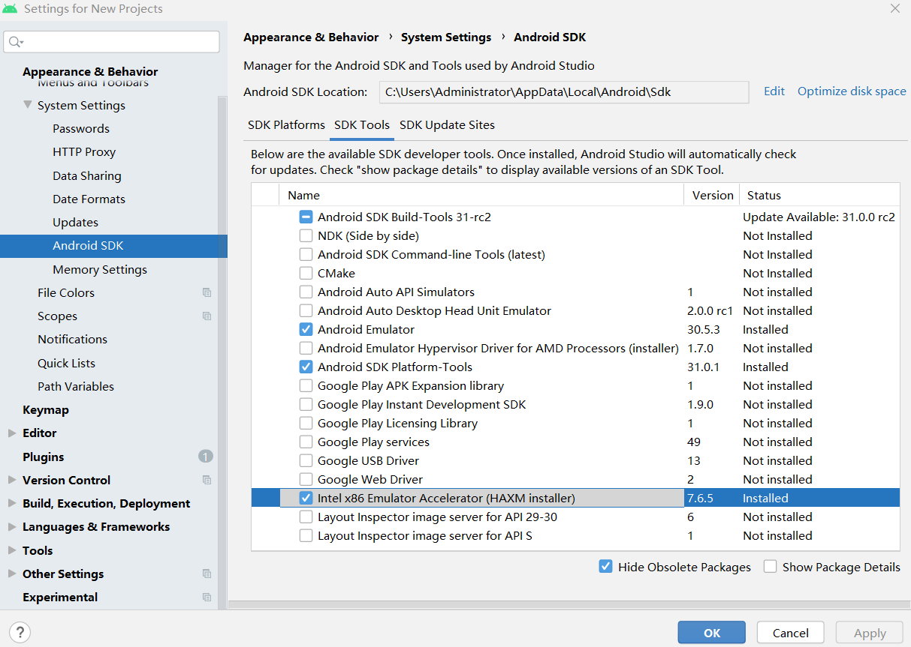
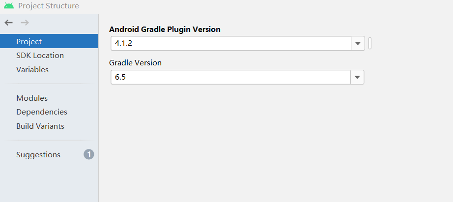
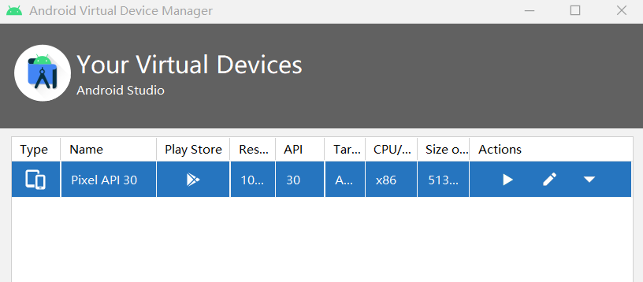

# 移动互联网安全第五章实验报告  
## 搭建Android模拟器环境  
### 实验要求  
 - [x] 安装和配置 Java SDK  
 - [x] 安装 Android Studio  
 - [x] 下载安装 Android SDK  
 - [x] 配置 Android 模拟器运行环境  
 - [x] 配置 Gradle 编译环境  

### 实验环境  
* Windows 10  
* Android Studio 4.1.2  

### 实验过程  
#### 安装和配置 Java SDK  
* Java SDK 版本的选择  
参考[Java 官方版本支持计划](https://www.oracle.com/java/technologies/java-se-support-roadmap.html)，首选LTS(长期支持，Long-Term-Support)版本，例如 Release 11，确保可获得足够长时间的官方维护和更新支持  
  

* 成功安装  
  

#### 安装 Android Studio  
* 下载[Android Studio](http://www.android-studio.org/)  
由于国外官网下载期间频繁发生网络中断，改为镜像下载[Android Studio](https://developer.android.google.cn/studio#downloads)  
* 根据提示安装  
  

#### 下载安装 Android SDK  
* 启动 Android Studio，默认安装 SDK 版本为 Android 11.0 (R)，后期可根据需要手动下载其他版本  
  

#### 配置 Android 模拟器运行环境  
* 在`SDK Tools`界面下载安装`Intel x86 Emulator Accelerator (HAXM installer)`  
  

#### 配置 Gradle 编译环境  
* Android Studio Gradle 插件版本  
  

#### 问题及解决  
1. 创建AVD进行尝试  
  
:joy:部分功能还没弄懂，待进一步学习 [学习链接](https://developer.android.com/studio/run/managing-avds#createavd)  

##### 参考资料  
[移动互联网安全第五章实验](https://c4pr1c3.github.io/cuc-mis/chap0x05/exp.html)  
[在 Android 模拟器上运行应用](https://developer.android.com/studio/run/emulator)  

