# 移动互联网安全第七章实验报告  
## 软件逆向系列实验  
### 实验目的  
* 初步了解 Android 终端应用的逆向分析  
### 实验环境  
* Android Studio 4.2.1  
* Android 11.0 API 30 x86 - Pixel  
* Apktool  
* APKLab  
### 实验要求  
 - [x] 使用apktool反汇编上一章实验中我们开发的Hello World v2版程序，对比Java源代码和smali汇编代码之间的一一对应关系  
 - [x] 对Hello World v2版程序生成的APK文件进行程序图标替换，并进行重打包，要求可以安装到一台未安装过Hello World v2版程序的Android模拟器中  
 - [x] 尝试安装重打包版Hello World v2到一台已经安装过原版Hello World v2程序的模拟器中，观察出错信息并解释原因  
 - [x] 去掉Hello World v2版程序中DisplayMessageActivity.java代码中的那2行日志打印语句后编译出一个新的apk文件，假设文件名是：misdemo-v3.apk，尝试使用课件中介绍的几种软件逆向分析方法来破解我们的认证算法  
### 实验过程  
#### smali代码分析  
* 检出[Deliberately Vulnerable Android Hello World](https://github.com/c4pr1c3/DVAHW)最新代码，并将该项目导入Android Studio  
* `Build`->生成发布版APK，APK位置为`app/release/app-release.apk`  
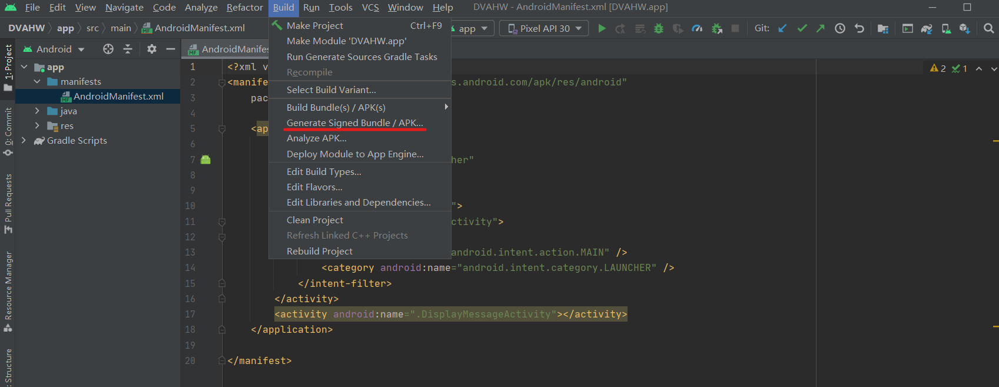  
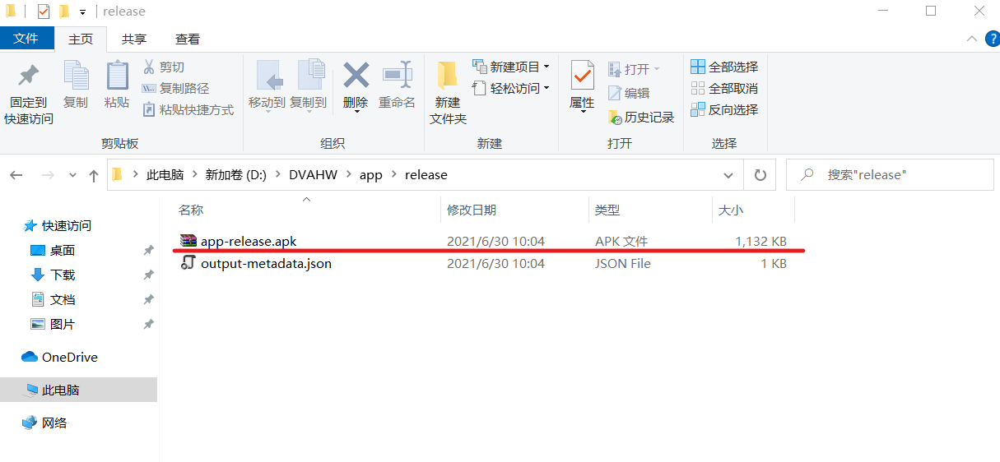  
* 当前App运行和使用效果证明  
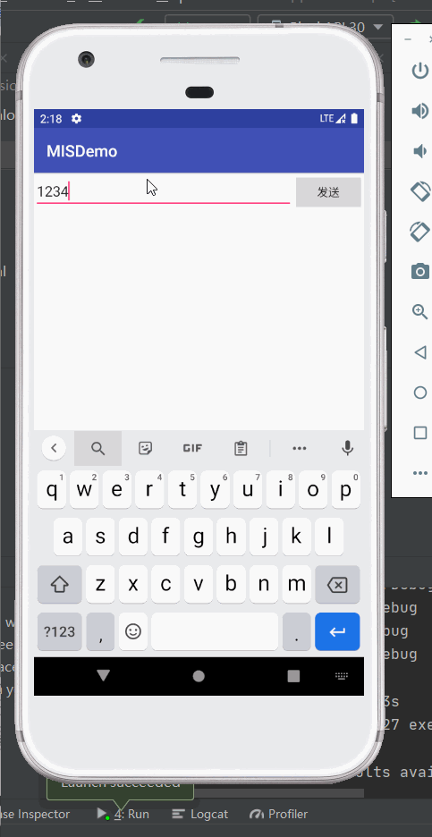  
* 使用VScode扩展APKLab完成APK反编译过程  
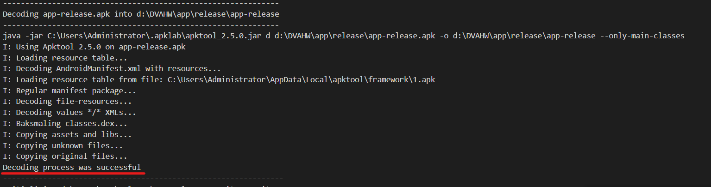  
* [Deliberately Vulnerable Android Hello World](https://github.com/c4pr1c3/DVAHW)在模拟器中运行，输入注册码错误时的提示为：注册失败  
依据此关键特征，在反汇编输出目录下进行关键字查找，可以在`res/values/strings.xml`中找到该关键字的注册变量名为`register_failed`  
    ```
    grep '注册失败' -R . 
    ./res/values/strings.xml:    <string name="register_failed">注册失败</string>
    ```  
* 用文本编辑器打开`res/values/strings.xml`查看下一行发现  
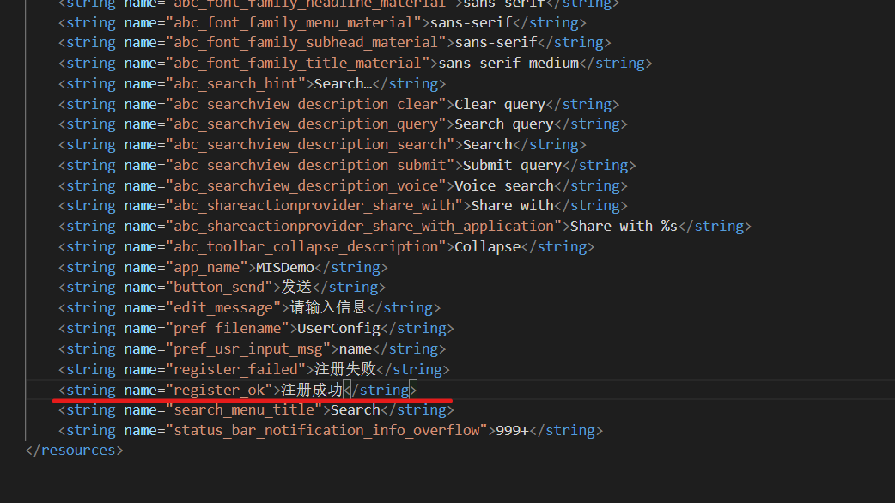  
* 继续在反汇编输出目录下进行关键字查找`register_ok`，可以发现  
`./smali/cn/edu/cuc/misdemo/R$string.smali:.field public static final register_ok:I = 0x7f060027`  
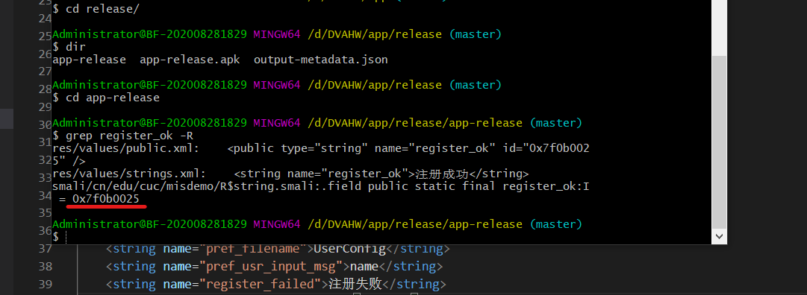  
* 使用该唯一标识符进行关键字查找，定位到这一段代码  
`./smali/cn/edu/cuc/misdemo/DisplayMessageActivity.smali:    const v5, 0x7f060027`  
* 根据源代码行号和smali代码中的.line 39，我们可以找到Android源代码中的Java代码和Smali代码之间的对应“翻译”关系  
* smali代码注释说明如下：  
    ```
    # 当前smali代码对应源代码的行号
    .line 39

    # 将 0x7f060027 赋值给寄存器v6
    const v5, 0x7f060027

    # invoke-virtual 是调用实例的虚方法（该方法不能是 private、static 或 final，也不能是构造函数）
    # 在非static方法中，p0代指this
    # 此处的实例对象是 cn.edu.cuc.misdemo.DisplayMessageActivity
    # Lcn/edu/cuc/misdemo/DisplayMessageActivity; 表示DisplayMessageActivity这个对象实例 getString是具体方法名
    # I表示参数是int类型
    # Ljava/lang/String; 表示 Java内置的String类型对象
    # 整个这一行smali代码表示的就是 调用 cn.edu.cuc.misdemo.DisplayMessageActivity对象的getString方法，传入一个整型参数值，得到String类型返回结果
    invoke-virtual {p0, v5}, Lcn/edu/cuc/misdemo/DisplayMessageActivity;->getString(I)Ljava/lang/String;

    # 将最新的 invoke-kind 的对象结果移到指定的寄存器中。该指令必须紧跟在（对象）结果不会被忽略的 invoke-kind 或 filled-new-array 之后执行，否则无效。
    # 其中 kind 典型取值如virtual、super、direct、static、interface等，详见Android开源官网的 'Dalvik 字节码' 说明文档
    move-result-object v5

    # 此处的v4赋值发生在 .line 37，需要注意的是这里的v4是一个局部变量（用v表示），并不是参数寄存器（用p表示）。
    # 当前initView()方法通过 .locals 定义了8个本地寄存器，用于保存局部变量，如下2行代码所示：
    # .method private initView()V
    #    .locals 8
    # V 表示 setText 的返回结果是 void 类型
    invoke-virtual {v4, v5}, Landroid/widget/TextView;->setText(Ljava/lang/CharSequence;)V
    ```  
#### 破解简单注册小程序  
* 改变原来的注册码相等条件判断语句，对布尔类型返回结果直接取反，达到：只要我们没有输入正确的验证码，就能通过验证的“破解”效果  
    * 将`if-eqz`修改为`if-nez`  
    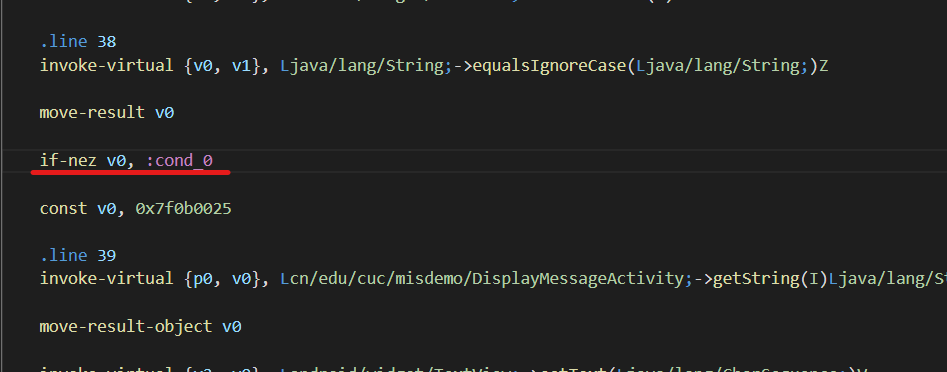  
* 在执行注册码相等条件判断语句之前，打印出用于和用户输入的注册码进行比较的“正确验证码”变量的值  
    * 在`invoke-virtual {v2, v3}, Ljava/lang/String;->equalsIgnoreCase(Ljava/lang/String;)Z`代码之前增加2行打印语句  
    `const-string v8, "tag-here"`  
    `invoke-static {v8, v3}, Landroid/util/Log;->v(Ljava/lang/String;Ljava/lang/String;)I`  
#### 重打包  
`apktool b app-release`  
#### 重签名  
```
cd app-release/dist/
<Android SDK Path>/build-tools/<valid version code>/apksigner sign --min-sdk-version 19 --ks <path to release.keystore.jks> --out app-release-signed.apk app-release.apk
```  
需要注意的是，上述重签名指令中用到的apksigner是包含在Android SDK的build-tools子目录下的，Android 7.0开始使用apksigner，7.0之前的版本，使用的Java SDK里的jarsigner  
#### 小实验过程  
* 使用APKLab自带的`apktool.yml`操作  
  
* 实现取反破解  
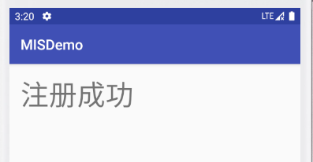  
#### 图标替换  
将`\res\mipmap-xxxhdpi\ic_launcher.png`替换成目标图标文件即可  
### 问题与解决  
1. 在原Android Studio 4.1.2环境下报错  
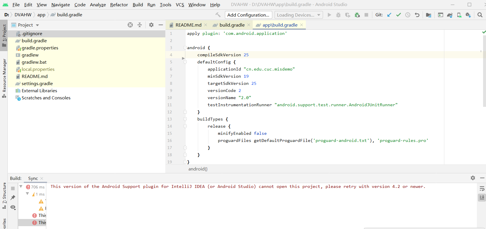  
错误原因：报错中写的非常明确，当前Android Studio版本过低，不支持导入该项目  
解决方案：重新安装Android Studio 4.2.1  
2. Android Studio进行build的过程中，lint报错  
错误原因：一着急并没有保存报错截图 嘻嘻  
解决方案：在`build.gradle`的`android {}`部分添加跳过语句  
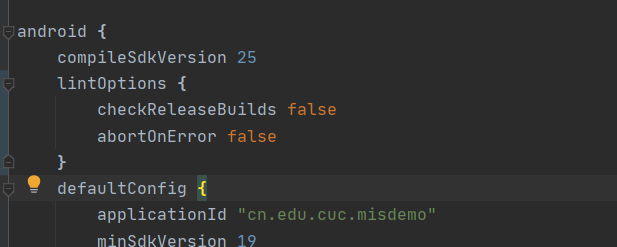  
3. 将重新生成的APK导入AVD时出现test-only报错  
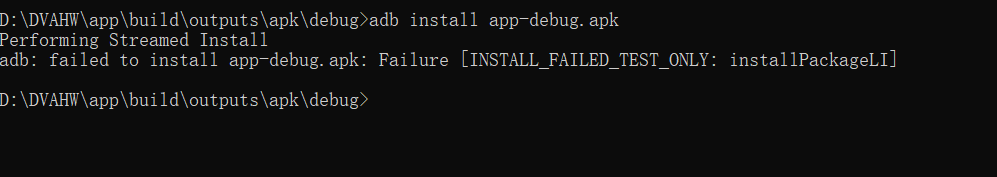  
错误原因：配置文件中`testOnly`值为true  
解决方案：将`testOnly`的参数值更改为false  

#### 参考资料  
[移动互联网安全第七章实验](https://c4pr1c3.github.io/cuc-mis/chap0x07/exp.html)  
[移动互联网安全第七章教学视频](https://www.bilibili.com/video/BV1rr4y1A7nz?p=134)  
[在Androidstudio中导出项目apk的方法](https://blog.csdn.net/jianiao/article/details/86481126)  
[AndroidStudio中打开新项目提示](https://www.cnblogs.com/badaoliumangqizhi/p/13959054.html)  
[Android testonly一直为true的问题](https://blog.csdn.net/LIHENHAO/article/details/79146211)  
[AS 3.0.1 打包APK 无法安装——testOnly = true](https://blog.csdn.net/longner/article/details/79812227?utm_medium=distribute.pc_relevant.none-task-blog-2%7Edefault%7EBlogCommendFromMachineLearnPai2%7Edefault-3.control&depth_1-utm_source=distribute.pc_relevant.none-task-blog-2%7Edefault%7EBlogCommendFromMachineLearnPai2%7Edefault-3.control)